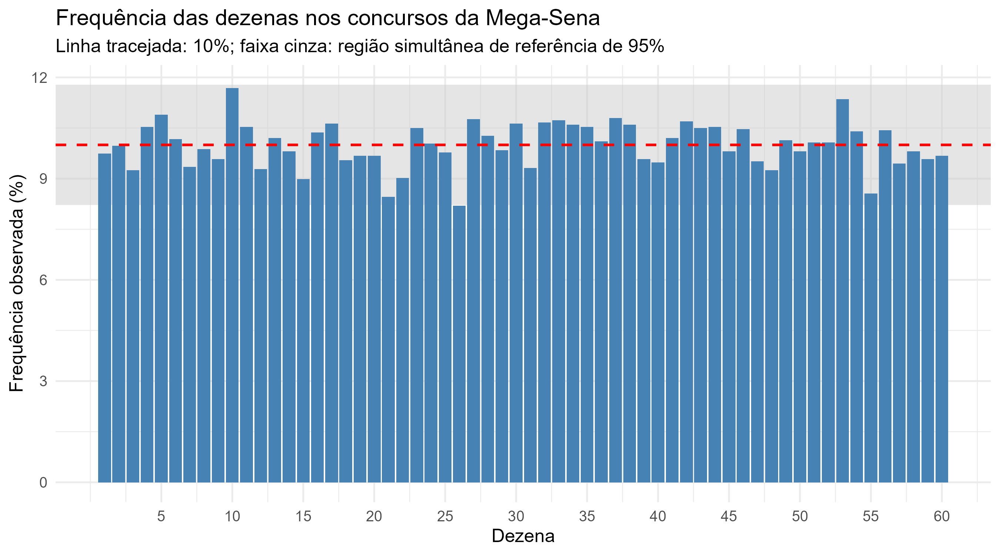
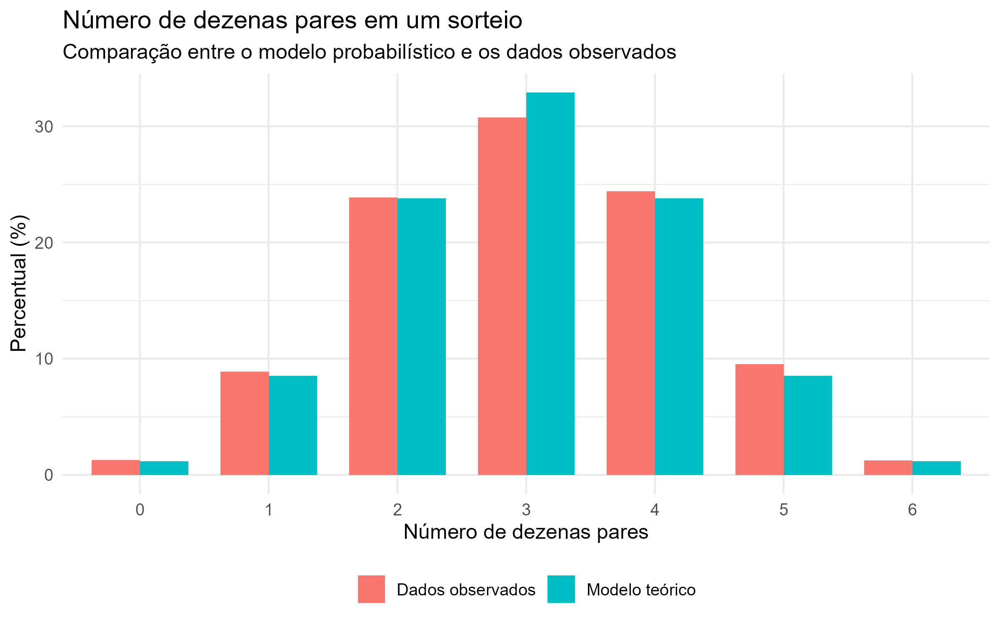
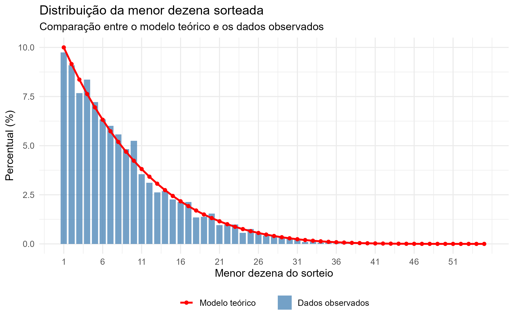
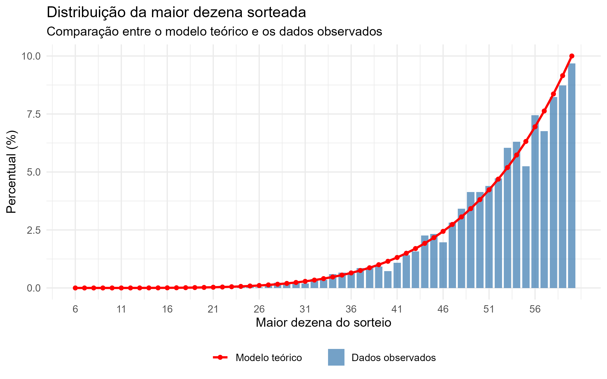
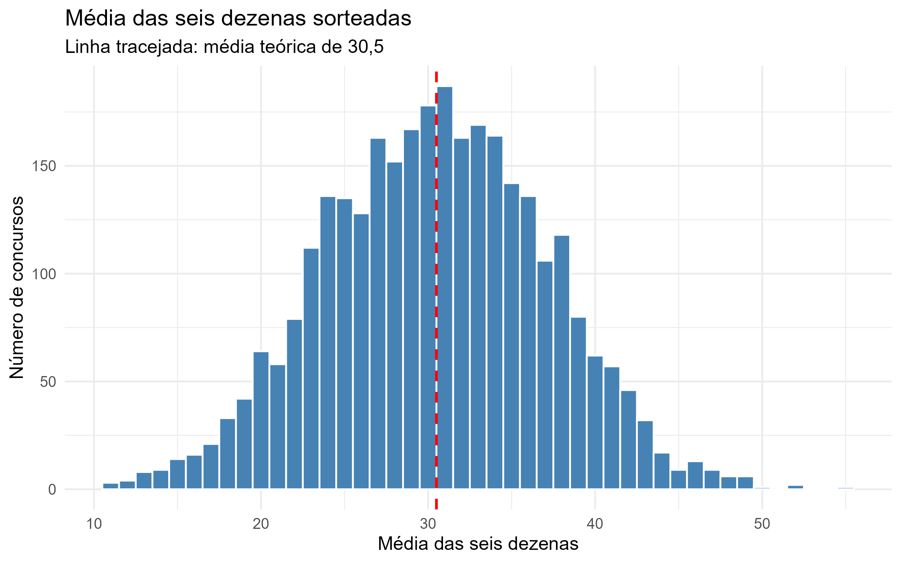

```{r setup, include=FALSE}
knitr::opts_chunk$set(
  echo = FALSE,
  warning = FALSE,
  message = FALSE
)

source("analise_megasena.R")
```


# Questão orientadora

Até que ponto as frequências observadas nos resultados históricos da Mega-Sena
são compatíveis com as probabilidades calculadas a partir de um modelo em que
todos os sorteios de seis dezenas entre 01 e 60 são igualmente prováveis?


# Base de dados e modelo probabilístico

Nesta atividade serão utilizados os resultados oficiais dos concursos da
Mega-Sena, divulgados pela Caixa Econômica Federal. Em cada concurso são
sorteadas seis dezenas distintas dentre as dezenas 01 a 60.

A base contém `r formatC(n_concursos, format = "d", big.mark = ".")` concursos
realizados entre `r format(periodo[1], "%d/%m/%Y")` e
`r format(periodo[2], "%d/%m/%Y")`.

Para cada concurso estão disponíveis o número do concurso, a data e as seis
dezenas sorteadas.

**Fonte:** Loterias CAIXA -- Mega-Sena

<https://loterias.caixa.gov.br/Paginas/mega-sena.aspx>

API utilizada pelo portal:

<https://servicebus2.caixa.gov.br/portaldeloterias/api/megasena>

Considerando o modelo em que todas as combinações de seis dezenas são
equiprováveis,

$$
|\Omega|
=
\binom{60}{6}
=
`r formatC(
  N_COMBINACOES,
  format = "f",
  digits = 0,
  big.mark = ".",
  decimal.mark = ","
)`.
$$

A atividade compara probabilidades calculadas nesse modelo com frequências
observadas nos concursos históricos.


# Exploração inicial

Antes de analisar os dados, responda utilizando apenas o modelo probabilístico.

1. Qual é a probabilidade de uma determinada dezena, por exemplo a dezena 10,
   aparecer em um sorteio?

2. Qual é a probabilidade de exatamente três das seis dezenas sorteadas serem
   pares?

3. Qual é a probabilidade de todas as seis dezenas sorteadas serem pares?

4. As combinações

   $$
   \{01,02,03,04,05,06\}
   \qquad\text{e}\qquad
   \{07,19,28,36,44,59\}
   $$

   têm a mesma probabilidade? Justifique.

5. Em uma sequência de $n$ concursos, quantas vezes você esperaria,
   aproximadamente, que uma determinada dezena aparecesse?


# Frequência observada das 60 dezenas

Para uma dezena fixada,

$$
P(\text{dezena sorteada})
=
\frac{\binom{59}{5}}{\binom{60}{6}}
=
\frac{6}{60}
=
0{,}10.
$$

Portanto, nos `r formatC(n_concursos, format = "d", big.mark = ".")` concursos,
o número esperado de aparições de uma dezena específica é

$$
`r formatC(n_concursos, format = "d", big.mark = ".")`
\times 0{,}10
=
`r formatC(
  n_esperado_dezena,
  format = "f",
  digits = 1,
  decimal.mark = ","
)`.
$$

A dezena 10 apareceu em `r n_dezena_10` concursos, correspondendo à frequência

$$
\frac{`r n_dezena_10`}
     {`r formatC(n_concursos, format = "d", big.mark = ".")`}
\approx
`r formatC(
  100 * freq_dezena_10,
  format = "f",
  digits = 2,
  decimal.mark = ","
)`\%.
$$

O gráfico abaixo apresenta as frequências observadas das 60 dezenas.

```{r grafico-frequencias, out.width="92%", fig.align="center"}

```

A linha tracejada representa a probabilidade teórica de 10%. A faixa cinza foi
construída por meio de `r formatC(B, format = "d", big.mark = ".")` simulações
de forma que, sob o modelo, em cerca de 95% das simulações as frequências das
60 dezenas ficassem simultaneamente dentro da faixa.

A região obtida foi

$$
`r formatC(
  100 * limite_simultaneo_inferior,
  format = "f",
  digits = 2,
  decimal.mark = ","
)`\%
\leq
\widehat p_j
\leq
`r formatC(
  100 * limite_simultaneo_superior,
  format = "f",
  digits = 2,
  decimal.mark = ","
)`\%,
\qquad
j=1,\ldots,60.
$$

A maior frequência observada foi a da dezena
`r dezena_maxima$dezena[1]`:

$$
\frac{`r dezena_maxima$n[1]`}
     {`r formatC(n_concursos, format = "d", big.mark = ".")`}
\approx
`r formatC(
  dezena_maxima$frequencia_pct[1],
  format = "f",
  digits = 2,
  decimal.mark = ","
)`\%.
$$

A menor frequência observada foi a da dezena
`r dezena_minima$dezena[1]`:

$$
\frac{`r dezena_minima$n[1]`}
     {`r formatC(n_concursos, format = "d", big.mark = ".")`}
\approx
`r formatC(
  dezena_minima$frequencia_pct[1],
  format = "f",
  digits = 2,
  decimal.mark = ","
)`\%.
$$

A dezena `r dezena_minima$dezena[1]` ficou ligeiramente abaixo do limite
inferior da faixa. Isso não significa, por si só, que o modelo seja inadequado:
mesmo quando o modelo é correto, em cerca de 5% das repetições sob o modelo,
pelo menos uma das 60 frequências ficaria fora dessa faixa.


# Outro exemplo de comparação entre o modelo e os dados

Considere o evento em que todas as seis dezenas sorteadas pertencem ao conjunto
$\{1,\ldots,30\}$. Sob o modelo equiprovável,

$$
P(\text{todas as dezenas}\leq30)
=
\frac{\binom{30}{6}}
     {\binom{60}{6}}
\approx
`r formatC(
  100 * prob_todas_ate_30,
  format = "f",
  digits = 2,
  decimal.mark = ","
)`\%.
$$

Nos `r formatC(n_concursos, format = "d", big.mark = ".")` concursos analisados,
esse evento ocorreu em `r n_todas_ate_30` sorteios, correspondendo à frequência

$$
\frac{`r n_todas_ate_30`}
     {`r formatC(n_concursos, format = "d", big.mark = ".")`}
\approx
`r formatC(
  100 * freq_todas_ate_30,
  format = "f",
  digits = 2,
  decimal.mark = ","
)`\%.
$$

Assim, a probabilidade teórica é aproximadamente
`r formatC(
  100 * prob_todas_ate_30,
  format = "f",
  digits = 2,
  decimal.mark = ","
)`\%,
enquanto a frequência observada foi aproximadamente
`r formatC(
  100 * freq_todas_ate_30,
  format = "f",
  digits = 2,
  decimal.mark = ","
)`\%.

Esse exemplo também mostra que eventos definidos de maneiras diferentes podem
ter a mesma probabilidade. Por exemplo, “todas as dezenas são pares”,
“todas as dezenas são ímpares” e “todas as dezenas são menores ou iguais a 30”
exigem, em cada caso, que as seis dezenas pertençam inteiramente a um subconjunto
fixado de 30 elementos.


# Número de dezenas pares no sorteio

Se $X$ representa o número de dezenas pares entre as seis sorteadas, então

$$
P(X=k)
=
\frac{
\binom{30}{k}
\binom{30}{6-k}
}{
\binom{60}{6}
},
\qquad
k=0,1,\ldots,6.
$$

O gráfico compara, para todos os valores possíveis de $k$, a distribuição
prevista pelo modelo com as frequências observadas nos
`r formatC(n_concursos, format = "d", big.mark = ".")` concursos.

```{r grafico-pares, out.width="85%", fig.align="center"}

```

Por exemplo,

$$
P(X=3)
=
\frac{\binom{30}{3}\binom{30}{3}}
     {\binom{60}{6}}
\approx
`r formatC(
  100 * prob_3_pares,
  format = "f",
  digits = 2,
  decimal.mark = ","
)`\%.
$$

A frequência observada foi

$$
`r formatC(
  100 * freq_3_pares,
  format = "f",
  digits = 2,
  decimal.mark = ","
)`\%.
$$

Nos casos extremos,

$$
P(X=0)
=
P(X=6)
=
\frac{\binom{30}{6}}
     {\binom{60}{6}}
\approx
`r formatC(
  100 * prob_6_pares,
  format = "f",
  digits = 2,
  decimal.mark = ","
)`\%.
$$

As frequências observadas foram aproximadamente

- `r formatC(
    100 * freq_6_impares,
    format = "f",
    digits = 2,
    decimal.mark = ","
  )`\% para seis dezenas ímpares;
- `r formatC(
    100 * freq_6_pares,
    format = "f",
    digits = 2,
    decimal.mark = ","
  )`\% para seis dezenas pares.


# Mínimo, máximo e média das dezenas sorteadas

Cada concurso também pode ser resumido por

$$
L=\min(X_1,\ldots,X_6),
\qquad
U=\max(X_1,\ldots,X_6),
\qquad
\overline X=\frac{X_1+\cdots+X_6}{6}.
$$


## Menor dezena sorteada

Para que $L=l$, a dezena $l$ deve estar presente e as outras cinco devem ser
escolhidas entre $l+1,\ldots,60$. Logo,

$$
P(L=l)
=
\frac{\binom{60-l}{5}}
     {\binom{60}{6}},
\qquad
l=1,\ldots,55.
$$

```{r grafico-minimo, out.width="85%", fig.align="center"}

```

Segundo o modelo, a moda é
$L=`r moda_minimo_teorica$minimo[1]`$, com probabilidade

`r formatC(
  moda_minimo_teorica$prob_teorica_pct[1],
  format = "f",
  digits = 2,
  decimal.mark = ","
)`\%.

Nos dados, a moda observada também foi
`r moda_minimo_observada$minimo[1]`, com frequência

$$
\frac{`r moda_minimo_observada$n[1]`}
     {`r formatC(n_concursos, format = "d", big.mark = ".")`}
\approx
`r formatC(
  moda_minimo_observada$frequencia_pct[1],
  format = "f",
  digits = 2,
  decimal.mark = ","
)`\%.
$$

O maior valor observado para o mínimo foi `r maior_minimo`.


## Maior dezena sorteada

Analogamente,

$$
P(U=u)
=
\frac{\binom{u-1}{5}}
     {\binom{60}{6}},
\qquad
u=6,\ldots,60.
$$

```{r grafico-maximo, out.width="85%", fig.align="center"}

```

Segundo o modelo, a moda é
$U=`r moda_maximo_teorica$maximo[1]`$, com probabilidade

`r formatC(
  moda_maximo_teorica$prob_teorica_pct[1],
  format = "f",
  digits = 2,
  decimal.mark = ","
)`\%.

Nos dados, a moda observada também foi
`r moda_maximo_observada$maximo[1]`, com frequência

$$
\frac{`r moda_maximo_observada$n[1]`}
     {`r formatC(n_concursos, format = "d", big.mark = ".")`}
\approx
`r formatC(
  moda_maximo_observada$frequencia_pct[1],
  format = "f",
  digits = 2,
  decimal.mark = ","
)`\%.
$$

O menor valor observado para o máximo foi `r menor_maximo`.

Há uma simetria natural entre as duas distribuições:

$$
P(L=l)=P(U=61-l).
$$

A transformação

$$
x\longmapsto61-x
$$

troca valores pequenos por grandes e leva cada combinação possível em outra
combinação possível. Por isso, a distribuição teórica do máximo é a imagem
espelhada da distribuição teórica do mínimo.


## Média das seis dezenas

Como a média das dezenas $1,\ldots,60$ é

$$
\frac{1+60}{2}=30{,}5,
$$

temos

$$
E(\overline X)=30{,}5.
$$

Para uma dezena escolhida ao acaso em $\{1,\ldots,60\}$,

$$
\operatorname{Var}(X)
=
\frac{60^2-1}{12}.
$$

Como o sorteio é feito sem reposição,

$$
\operatorname{Var}(\overline X)
=
\frac{\operatorname{Var}(X)}{6}
\frac{60-6}{60-1},
$$

de modo que

$$
\operatorname{DP}(\overline X)
\approx
`r formatC(
  dp_media_teorico,
  format = "f",
  digits = 2,
  decimal.mark = ","
)`.
$$

```{r grafico-media, out.width="85%", fig.align="center"}

```

Os valores observados foram muito próximos dos previstos pelo modelo:

| Medida | Modelo teórico | Dados observados |
|---|---:|---:|
| Média | `r formatC(comparacao_media$teorico[comparacao_media$medida == "Média"], format = "f", digits = 1, decimal.mark = ",")` | `r formatC(comparacao_media$observado[comparacao_media$medida == "Média"], format = "f", digits = 1, decimal.mark = ",")` |
| Desvio-padrão | `r formatC(comparacao_media$teorico[comparacao_media$medida == "Desvio-padrão"], format = "f", digits = 2, decimal.mark = ",")` | `r formatC(comparacao_media$observado[comparacao_media$medida == "Desvio-padrão"], format = "f", digits = 2, decimal.mark = ",")` |

A menor média observada foi
`r formatC(
  resumo_media$menor_media,
  format = "f",
  digits = 1,
  decimal.mark = ","
)`
e a maior foi
`r formatC(
  resumo_media$maior_media,
  format = "f",
  digits = 2,
  decimal.mark = ","
)`.


# Padrões que parecem pouco aleatórios

## Combinações específicas

Considere as combinações

$$
\{01,02,03,04,05,06\}
\qquad\text{e}\qquad
\{07,19,28,36,44,59\}.
$$

Sob o modelo equiprovável, qualquer combinação específica tem probabilidade

$$
P(\text{combinação específica})
=
\frac{1}{\binom{60}{6}}
=
\frac{1}
     {`r formatC(
       N_COMBINACOES,
       format = "f",
       digits = 0,
       big.mark = ".",
       decimal.mark = ","
     )`}.
$$

Portanto, as duas combinações têm exatamente a mesma probabilidade, embora uma
delas possa parecer visualmente menos aleatória.

Nos `r formatC(n_concursos, format = "d", big.mark = ".")` concursos analisados,

- $\{01,02,03,04,05,06\}$ ocorreu
  `r n_combinacao_1` vezes;
- $\{07,19,28,36,44,59\}$ ocorreu
  `r n_combinacao_2` vezes.


## Dezenas consecutivas

A presença de números consecutivos também pode parecer pouco aleatória. Para
calcular sua probabilidade, é mais simples considerar inicialmente o evento
complementar.

Se

$$
1\leq x_1<\cdots<x_6\leq60
$$

não contém números consecutivos, a transformação

$$
y_i=x_i-(i-1)
$$

produz uma escolha arbitrária de seis números entre 1 e 55. Assim,

$$
P(\text{nenhum par consecutivo})
=
\frac{\binom{55}{6}}
     {\binom{60}{6}}.
$$

Logo,

$$
P(\text{pelo menos um par consecutivo})
=
1-
\frac{\binom{55}{6}}
     {\binom{60}{6}}
\approx
`r formatC(
  100 * prob_com_consecutivas,
  format = "f",
  digits = 2,
  decimal.mark = ","
)`\%.
$$

Nos dados históricos, houve pelo menos um par de dezenas consecutivas em
`r n_com_consecutivas`
dos `r formatC(n_concursos, format = "d", big.mark = ".")` concursos.

A frequência observada foi aproximadamente

$$
`r formatC(
  100 * freq_com_consecutivas,
  format = "f",
  digits = 2,
  decimal.mark = ","
)`\%.
$$

Esse exemplo mostra que um padrão visualmente marcante pode ter probabilidade
relativamente alta sob o modelo equiprovável.


# Apostas com mais de seis dezenas

Uma aposta da Mega-Sena pode conter mais de seis dezenas. Isso introduz duas
questões diferentes:

1. qual é a probabilidade de uma aposta de $m$ dezenas conter 4, 5 ou 6 das
   dezenas sorteadas?
2. quantas combinações premiadas estão contidas em uma aposta múltipla?

## Probabilidade de 4, 5 ou 6 acertos

Suponha que sejam escolhidas $m$ dezenas e que $X$ represente quantas delas
aparecem entre as seis sorteadas.

Para obter exatamente $k$ acertos,

$$
P(X=k)
=
\frac{
\binom{m}{k}
\binom{60-m}{6-k}
}{
\binom{60}{6}
}.
$$

Para apostas contendo 6, 7, 8 ou 10 dezenas:

```{r tabela-apostas, results='asis'}
m_apostas_prob <- m_apostas

tabela_apostas <- data.frame(
  `Dezenas apostadas` = m_apostas_prob,

  `4 acertos` = sub(
    ".", ",",
    sprintf(
      "%.5f%%",
      100 *
        choose(m_apostas_prob, 4) *
        choose(N_DEZENAS - m_apostas_prob, 2) /
        N_COMBINACOES
    ),
    fixed = TRUE
  ),

  `5 acertos` = sub(
    ".", ",",
    sprintf(
      "%.7f%%",
      100 *
        choose(m_apostas_prob, 5) *
        choose(N_DEZENAS - m_apostas_prob, 1) /
        N_COMBINACOES
    ),
    fixed = TRUE
  ),

  `6 acertos` = sub(
    ".", ",",
    sprintf(
      "%.9f%%",
      100 *
        choose(m_apostas_prob, 6) /
        N_COMBINACOES
    ),
    fixed = TRUE
  ),

  check.names = FALSE
)

knitr::kable(
  tabela_apostas,
  align = c("c", "c", "c", "c")
)
```

A probabilidade de acerto aumenta à medida que cresce o número de dezenas
escolhidas.


## Uma aposta múltipla contém várias apostas simples

Uma aposta com $m$ dezenas contém

$$
\binom{m}{6}
$$

combinações distintas de seis dezenas.

Para os valores considerados nesta atividade:

```{r tabela-combinacoes-apostas, results='asis'}
tabela_combinacoes_html <- tabela_sena_apostas |>
  transmute(
    `Dezenas apostadas` = dezenas_apostadas,
    `Combinações simples` = combinacoes_simples,
    `Chance de Sena (1 em)` =
      formatC(
        uma_em,
        format = "d",
        big.mark = "."
      )
  )

knitr::kable(
  tabela_combinacoes_html,
  align = c("c", "c", "r")
)
```

Assim,

$$
\binom{6}{6}=1,\qquad
\binom{7}{6}=7,\qquad
\binom{8}{6}=28,\qquad
\binom{10}{6}=210.
$$

Portanto, a probabilidade de a aposta conter todas as seis dezenas sorteadas é

$$
P(\text{Sena com }m\text{ dezenas})
=
\frac{\binom{m}{6}}
     {\binom{60}{6}}.
$$

A chance de Sena cresce exatamente na mesma proporção que o número de
combinações simples contidas na aposta.

Se o custo de uma aposta múltipla for proporcional ao número de combinações
simples que ela contém, então uma aposta de $m$ dezenas custa
$\binom{m}{6}$ vezes o valor de uma aposta simples e também multiplica por
$\binom{m}{6}$ a probabilidade de Sena. Nesse sentido, não há ganho de
probabilidade por unidade de custo apenas por concentrar várias combinações em
uma única aposta múltipla.


## Uma aposta que acerta a Sena também pode gerar Quinas e Quadras

Há agora uma segunda contagem.

Suponha que uma aposta de $m$ dezenas contenha as seis dezenas efetivamente
sorteadas. Entre as $\binom{m}{6}$ combinações simples contidas nessa aposta,
podemos perguntar quantas têm 6, 5 ou 4 acertos.

Se uma combinação interna tiver exatamente $k$ acertos, devemos escolher
$k$ das seis dezenas sorteadas e completar a combinação com $6-k$ das
$m-6$ dezenas restantes da aposta. Portanto,

$$
N_k
=
\binom{6}{k}
\binom{m-6}{6-k}.
$$

Para a Sena,

$$
N_6
=
\binom{6}{6}
\binom{m-6}{0}
=
1.
$$

Para a Quina,

$$
N_5
=
\binom{6}{5}
\binom{m-6}{1}
=
6(m-6).
$$

Para a Quadra,

$$
N_4
=
\binom{6}{4}
\binom{m-6}{2}.
$$

```{r tabela-premios-sena, results='asis'}
tabela_premios_html <- premios_se_acerta_sena |>
  transmute(
    `Dezenas apostadas` = dezenas_apostadas,
    Sena = sena,
    Quinas = quinas,
    Quadras = quadras
  )

knitr::kable(
  tabela_premios_html,
  align = c("c", "c", "c", "c")
)
```

Assim, uma aposta simples de seis dezenas que acerta a Sena contém apenas uma
combinação premiada: a própria Sena.

Já uma aposta múltipla pode produzir outros prêmios. Por exemplo, se uma aposta
de oito dezenas contém as seis dezenas sorteadas, suas
`r tabela_sena_apostas$combinacoes_simples[
  tabela_sena_apostas$dezenas_apostadas == 8
]`
combinações simples incluem

$$
`r premios_se_acerta_sena$sena[
  premios_se_acerta_sena$dezenas_apostadas == 8
]`
\text{ Sena},
\qquad
`r premios_se_acerta_sena$quinas[
  premios_se_acerta_sena$dezenas_apostadas == 8
]`
\text{ Quinas},
\qquad
`r premios_se_acerta_sena$quadras[
  premios_se_acerta_sena$dezenas_apostadas == 8
]`
\text{ Quadras}.
$$

Essa contagem é diferente da probabilidade de obter exatamente 4, 5 ou 6
acertos. A primeira pergunta é feita **antes do sorteio** e diz respeito ao
número de dezenas sorteadas que pertencem à aposta. A segunda é feita
**condicionalmente ao resultado da aposta múltipla** e conta quantas das
combinações simples contidas nela recebem cada tipo de premiação.


# Verificando a compreensão

As questões a seguir têm o objetivo de verificar a compreensão das ideias,
resultados e interpretações apresentados ao longo do texto.

1. No gráfico das frequências das 60 dezenas, por que as frequências observadas
   não são todas iguais a 10%? Esse comportamento é compatível com o modelo
   equiprovável? Explique.

2. Algumas dezenas aparecem mais vezes do que outras. Esse fato é incompatível
   com o modelo de equiprobabilidade?

3. Como deve ser interpretado o fato de a dezena
   `r dezena_minima$dezena[1]` ter ficado ligeiramente fora da faixa simultânea
   de referência?

4. A frequência da dezena 10 foi aproximadamente
   `r formatC(
     100 * freq_dezena_10,
     format = "f",
     digits = 2,
     decimal.mark = ","
   )`\%, enquanto o modelo prevê 10%. Essa diferença, isoladamente, fornece
   evidência contra o modelo?

5. Uma dezena que não aparece há vários concursos está “atrasada”? Os resultados
   anteriores alteram sua probabilidade no próximo sorteio?

6. Por que as distribuições do mínimo e do máximo apresentam formas espelhadas?

7. Compare a média e o desvio-padrão observados de $\overline X$ com os
   respectivos valores previstos pelo modelo. O que essa comparação sugere
   sobre a adequação do modelo aos dados?

8. Por que sequências contendo dezenas consecutivas podem parecer improváveis
   mesmo tendo probabilidade de aproximadamente
   `r formatC(
     100 * prob_com_consecutivas,
     format = "f",
     digits = 0,
     decimal.mark = ","
   )`\%?

9. Retome a questão orientadora da atividade: até que ponto as frequências
   observadas nos resultados históricos da Mega-Sena são compatíveis com as
   probabilidades previstas pelo modelo equiprovável? Justifique sua resposta
   utilizando as análises realizadas ao longo da atividade.

10. Uma aposta de 8 dezenas que contém as seis dezenas sorteadas gera,
    além de uma Sena,
    `r premios_se_acerta_sena$quinas[
      premios_se_acerta_sena$dezenas_apostadas == 8
    ]` Quinas e
    `r premios_se_acerta_sena$quadras[
      premios_se_acerta_sena$dezenas_apostadas == 8
    ]` Quadras. Explique, utilizando coeficientes binomiais, de onde vêm esses
    números.


# Síntese

Nesta atividade comparamos duas quantidades distintas:

$$
\underbrace{P(A)}_{\text{probabilidade no modelo}}
\qquad\text{e}\qquad
\underbrace{
\frac{\text{número de concursos em que ocorreu }A}
     {\text{número total de concursos}}
}_{\text{frequência relativa nos dados}}.
$$

As probabilidades pertencem ao modelo; as frequências são calculadas a partir
dos dados. Em uma sequência finita de sorteios, não se espera que sejam
exatamente iguais.

Quando muitas características são examinadas ao mesmo tempo, como as
frequências das 60 dezenas, é necessário considerar conjuntamente sua
variabilidade. Por isso foi utilizada uma faixa simultânea de referência.

A questão central não é saber se os dados reproduzem exatamente as
probabilidades teóricas, mas se as diferenças observadas são plausíveis sob
o modelo probabilístico.